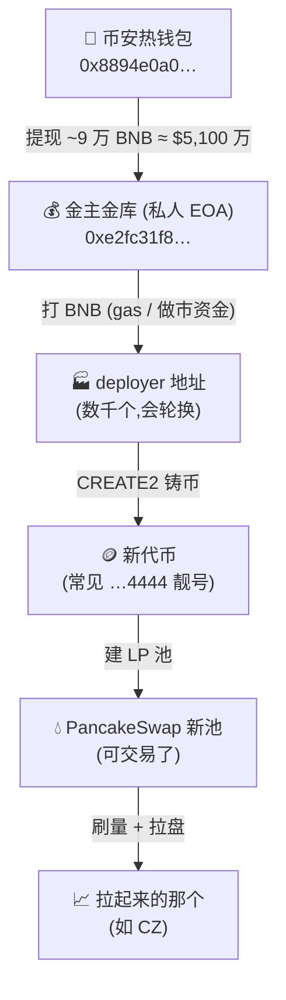
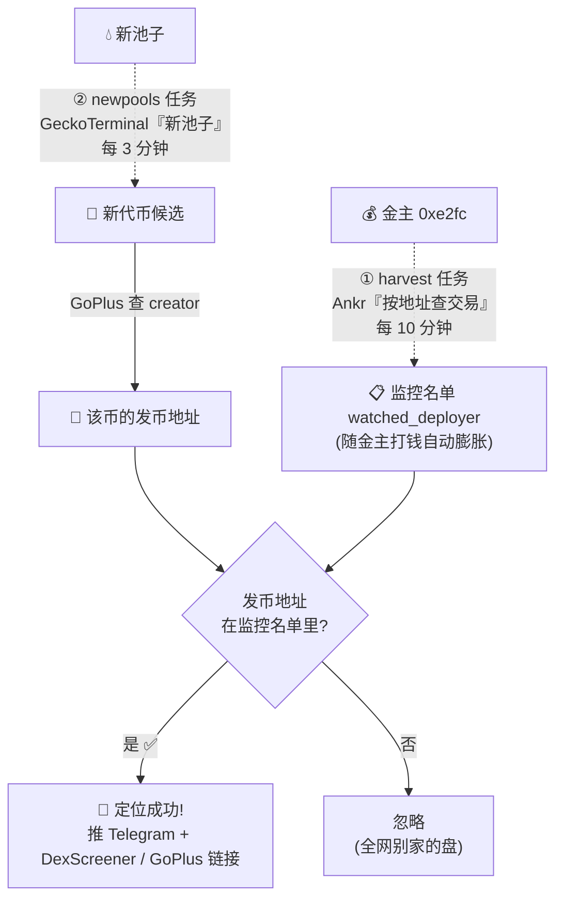
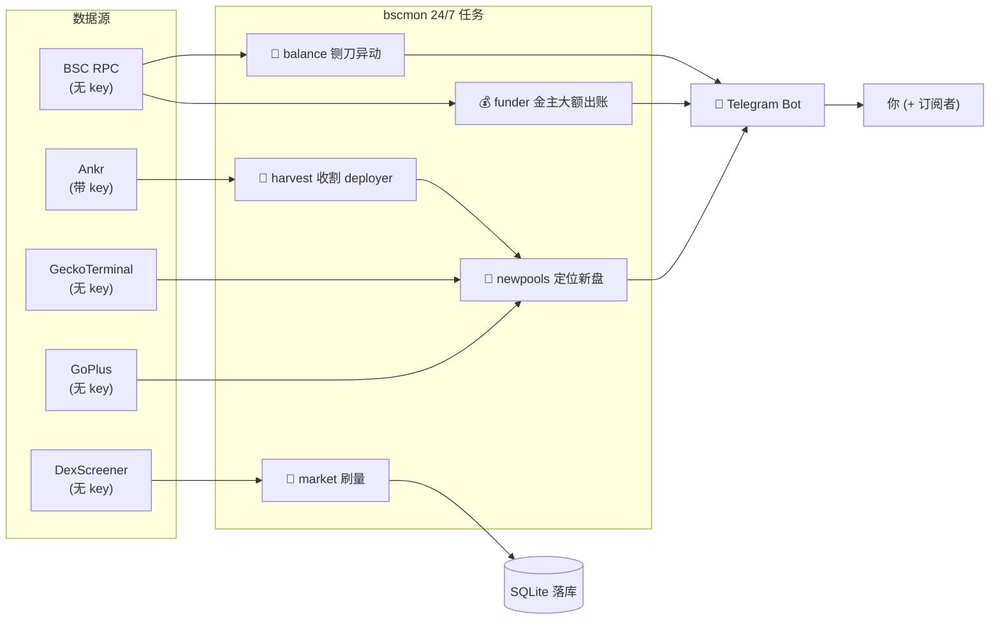

# 监控体系 · 我们是如何定位到「发币地址」的

> 核心思路:**发币地址会轮换、藏不住,但钱藏不住。** 我们不去猜哪个盘会拉,而是**顺着金主的钱**——先搞清"金主给谁打了钱"(那些就是 deployer),再守着"新池子"接住它们发的币。

---

## 一、链上事实:一条从币安到发币的资金链

**关键**:`deployer` 地址一次性、会换,直接盯它们盯不过来;但它们的**启动资金都来自同一个金主 `0xe2fc`**——所以只要盯住金主的出账,就能反推出所有 deployer。

---

## 二、我们的监控如何切进去(定位发币地址的主线)

三步闭环:

1. **① harvest(收割 deployer)** — 用 **Ankr Advanced API**(`ankr_getTransactionsByAddress`)拉金主 `0xe2fc` 的新 BNB 出账,把每个收款地址塞进「监控名单」。**这一步回答"金主给谁打了钱 = 谁是 deployer"。**(普通 RPC 做不到"按地址查交易",所以这里必须用 Ankr。)
2. **② newpools(守新盘)** — 用 **GeckoTerminal**(`new_pools`)每 3 分钟拉全网最新池子;每个新币用 **GoPlus** 查出它的 **creator(发币地址)**。
3. **③ 匹配** — 新币的发币地址只要落在监控名单里(种子 10 个 + 自动收割的),就 **🎯 定位成功**,把币和发币地址一起推给你。

> 为什么不用 `…4444` 靓号来抓?实测约六成新 BSC 土狗都用这个靓号,它是发币工具的通用默认,**抓不准我们这一网**。所以我们靠"资金关联(金主打过钱)+ creator 匹配",而不是靠靓号。

---

## 三、全景:所有信号 → Telegram

| 信号 | 数据源 | 触发 → 告警 |
|------|--------|-------------|
| 🔴 铡刀异动 | RPC `balanceOf` | CZ 冷钱包 700M 一动 → critical |
| 💰 金主大额出账 | RPC 余额 + 扫区块 | `0xe2fc` 出 ≥50 BNB → warn(带美元) |
| 🔁 收割 deployer | Ankr | 金主给谁打钱 → 自动进监控名单(不推,后台) |
| 🎯 定位新盘 | GeckoTerminal + GoPlus | 监控名单里的地址发新币 → warn |
| 🤖 刷量 | DexScreener | 换手倍数畸高 → 只落库 |

---

## 四、一句话总结

**藏得住地址,藏不住钱。** 金主 `0xe2fc` 是这张网唯一的资金枢纽——盯住它的出账(Ankr),就等于拿到了全网 deployer 的动态名单;再用公开的"新池子 + GoPlus creator"把它们发的币实时接住。**于是发币地址一冒头,我们就能在它拉盘之前定位到。**
